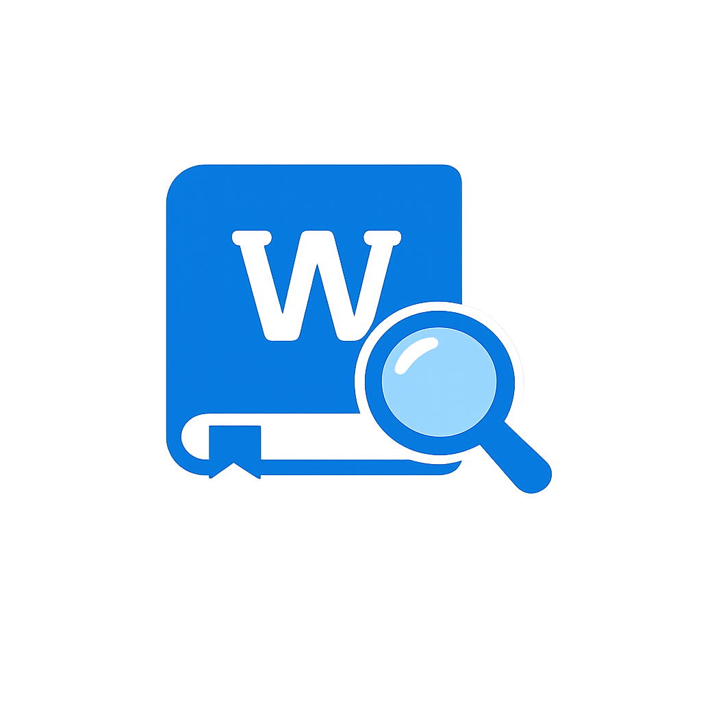

# WordPeek - Hover Dictionary

WordPeek is a Chrome extension that shows instant dictionary definitions when you select a word on any webpage.

## Features

- Select a word to see an inline popup definition.
- Shows phonetic text, part of speech, and example (when available).
- Optional pronunciation audio button.
- Toggle extension ON/OFF from the toolbar icon.
- Cancels stale requests and removes old popups cleanly.

## Tech Stack

- Manifest V3 Chrome Extension API (required for current Chrome extension platform).
- `content.js` for page-level selection handling and popup rendering.
- `background.js` service worker for persistent toggle state and toolbar updates.
- `styles.css` for popup UI and positioning styles.
- Dictionary source: <https://api.dictionaryapi.dev> (free public dictionary API).

## Project Structure

- `manifest.json` - Extension config, permissions, scripts, and assets.
- `background.js` - Toolbar toggle state, badge/icon updates, startup/install sync.
- `content.js` - Selection handling, popup rendering, dictionary fetch logic.
- `styles.css` - Popup UI styles.
- `icons/` - Extension and toggle icons.
- `SUBMISSION_NOTES.md` - Chrome Web Store publishing checklist and listing notes.

## Installation (Local)

1. Open Chrome and go to `chrome://extensions`.
2. Enable **Developer mode**.
3. Click **Load unpacked**.
4. Select this project folder (`wordpeek`).

## Usage

1. Open any webpage.
2. Select a word.
3. WordPeek displays meaning details in a popup near the selection.
4. Click the extension icon to toggle WordPeek ON/OFF.

## Permissions Used

- `storage`: saves enabled/disabled state.
- `tabs`: reloads open web tabs after install/update for clean activation.
- `host_permissions` for `https://api.dictionaryapi.dev/*`: fetches definitions.

## Notes and Limitations

- Works best with single English words.
- Multi-word selections may return no result or less accurate results from the dictionary API.
- Does not run on protected Chrome pages (for example, Chrome Web Store or `chrome://` pages).
- Requires internet access for dictionary lookups.
- Built for Chromium-based browsers that support Manifest V3.

## Changelog

### 1.0.0 - 2026-02-28

- Initial release with selection popup, pronunciation/audio support, and ON/OFF toggle.

## Contributing

Pull requests are welcome. Please open an issue first to discuss major changes.

## License

This project is licensed under the MIT License. See [LICENSE](LICENSE).
